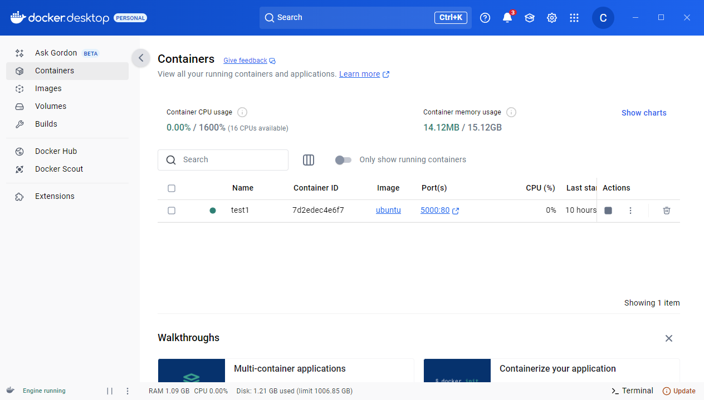
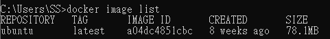
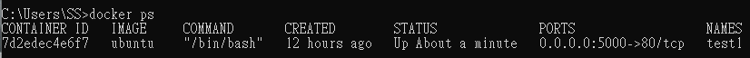
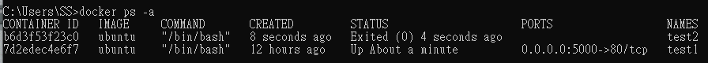
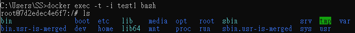
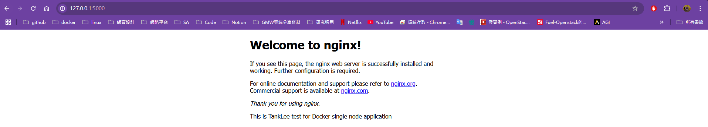

First, prepare the Docker environment (either Linux or Windows with Docker Desktop). In this example, we are using Windows Docker Desktop.<br>
<br>
## Step1: Pull Docker Images
Before creating a container, you need to pull some base images such as Ubuntu, Nginx, or CentOS. <br>
```
docker pull ubuntu
``` 

This command will download the last version ubuntu, if you will use diff. version ubuntu command show on below.<br>

```
docker pull ubuntu:22.04
```
After pulling the image, use  `docker image list`  to verify that the image is stored locally.

## Step2: Run a Container
Now, we can use `docker run` to implement container with special image, the command show on below:
```
docker run -i -t --name container1 -p 5000:80 ubuntu /bin/bash
```
### Docker run parameter 
The docker run usually use parameter shown on below:<br>
`-i` Keep STDIN open even if not attached <br> 
`-t` Allocate a pseudo-TTY <br>
`--name` Assign a name to the container <br>
`-p` Publish a containers port(s) to the host <br>
`/bin/bash` After container run will exec bash shell let user can turn command in terminal <br>
`-d,--detach` Run container in background and print container  <br>
`--restart` Restart policy to apply when a containers exits <br>
`--rm` Automatically remove the container and its associated anonymous volumes when it exits<br>
`--privileged` Give extended privileges to this container<br>
`--expose` Expose a port or a range of ports<br>
`-e` Set environment variables<br>
`--env-file` Read in a file of environment variables<br>
`-h, --hostname` Container host name<br>
`--add-host` Add a custom host-to-IP mapping (host:ip) <br>
`--device` Add a host device to the container<br>
`--dns` Set custom DNS servers <br>
`--gpus` GPU devices to add to the container <br>

After `docker run `, you can use `docker ps ` to check out container status which container is running and use `docker ps -a` can list all container whether started or not.<br>
docker ps <br>

docker ps -a <br>

## Step3: Access Running Container
You can use `docker exec -t -i {container ID or name} bash` to access container which is running.


Now~~~ the container has started, You can do some operation like use Linux system in container.<br>
## Step4: Intall and Start Nginx
In example we implement nginx website:
```
apt update -y
```
```
apt install nginx 
```
```
service nginx start
```
## Step7: Verify Website from Host Browser
In local(not container) you can open broswer(chrome, edge, firefox) to checkout nginx.

