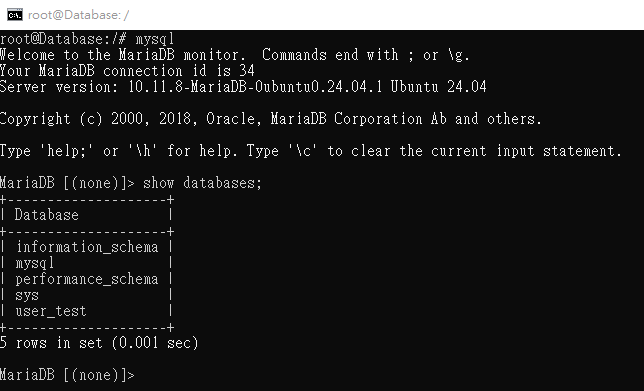
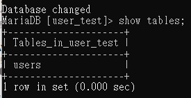
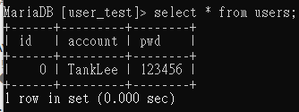
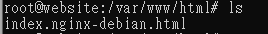
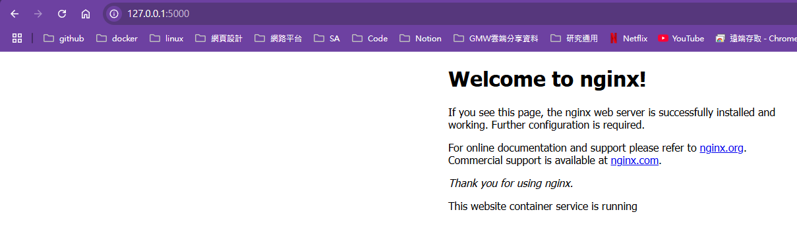

In this section, we will create two containers and install different services in each of them.<br>
One container implement website function the other one implement database with Ubuntu<br>
There are additional resource requirements for each container as shown below:<br>
website container: 1 CPU and 2GB memory <br>
database container: 2 CPU and 4GB memory <br>

Now start implement!!<br>
# Database 
In database, we choice mariaDB service.
## Step1: Create Database Container
```
docker run -i -t --name="Database" -p 3306:3306 --hostname="website" --cpus="2" -m 4g ubuntu /bin/bash
```
## Step2: Inntall and Configure MariaDB
```
apt update -y
apt install mariadb-server -y
service mariadb start # start DB service 
service mariadb enable # optional, this command will let service start when container start.
```
## Step3: Access mysql and create databases,table,data,etc.
```
mysql # access DB without pwd
```

We create some database and table for use
```
create database user_test;
use user_test
```
```
create table users(id INT, account varchar(50), pwd varchar(100));
```

```
insert into users(id,account,pwd) values(0,'TankLee','123456');
```


The database setup is complete.

# Website
In website, we choice nginx service
## Step1: Create Website Container
```
docker run -i -t --name="website" -p 5000:80 --hostname="website" --cpus="1" -m 2g ubuntu /bin/bash
```
## Step2: Install and Configure Nginx
```
apt update -y
apt install nginx -y
service nginx start
```
## Step3: Check and change index.html
When download finished, you can check /var/www/html
```
cd /var/www/html
```

```
vim ./index.nginx-debian.html
#In this step ,you can delete this file and create index.html for website index page.
```
## Step4: Verify Website from local Browser
After you change, in local pc browser you can type `127.0.0.1:5000` to check website is running or not.



