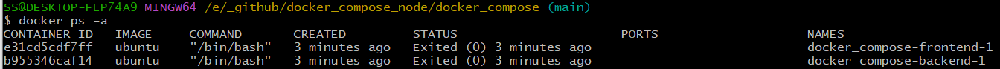

In this part we will create multiple(2) container and install diff. via docker compose file to create<br>

### What is docker compose file? <br>
In previous step training we create some application(website and database) via manual operation command to implement. <br>
If application requirement number of container are huge then 1000 containers, manual operation create node is not good idea, So we adpote automatic create this huge container, in docker you can use docker compose file to achieve this aim.<br>

Docker compose use a `YAML` configuration file, its can esay to configure your application services and then you create and start all the services from your configuration with the compose CLI.

### Compose.yaml and Compose.yml
```
#compose.yml
services: 
  frontend: # container name
    image: ubuntu # which image should be use
    ports: # container parameter
      - "443:8043"
  backend:  #container name
    image: ubuntu  # which image should be use
```
Above document is very simple `compose.yml` when use command `docker compose up` the docker will according `compose.yml` to create correspond container like below figure.

You can use previous step example to implement Database and Website.
```
#compose.yml
services: 
  Website: 
    image: ubuntu 
    ports: 
      - "5000:80"
    command: bash -c "apt update -y && bash"
  Database:  
    image: ubuntu  
    ports:
      - "3306:3306"
    command: bash -c "apt update -y && bash"
```

### Compose CLI(Command-line interface)
When you prepared compose file like `compose.yaml` or `compose.yml` you can use this CLI to operation.
```
docker compose up
```
```
docker compose down
```
```
docker compose logs
```
```
docker compose ps
```
