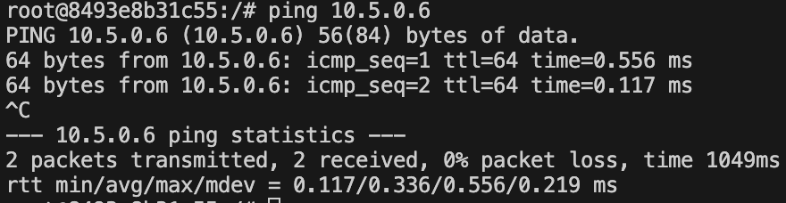
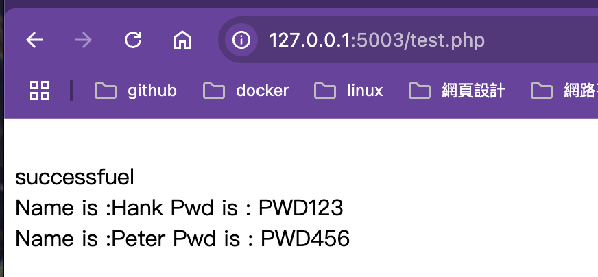
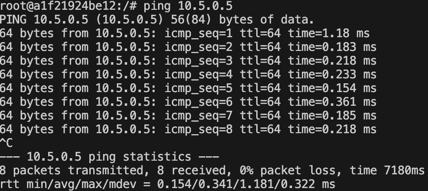

In this part we will create multiple(2) container and install diff. via docker compose file to create and configure network setting<br>

### Setup 
```
#compose.yml
services: 
  net_Website: 
    image: ubuntu 
    ports: 
      - "5003:80"
    networks:
      private_network:
        ipv4_address: 10.5.0.5
    command: bash -c "apt update -y && apt install nginx -y && service nginx start && tail -f /dev/null"
  net_Database:  
    image: ubuntu  
    ports:
      - "3306:3306"
    networks:
      private_network:
        ipv4_address: 10.5.0.6
    command: bash -c "apt update -y && apt install mariadb-server -y && service mariadb start && tail -f /dev/null"
networks:
  private_network: # network name 
    driver: bridge # what network driver
    ipam:
      config: #network configure
        - subnet: 10.5.0.0/16
          gateway: 10.5.0.1
```
In above compose file setting network as private network for container communication.<br>

### Website view

The Website node can connect Database(10.5.0.6)<br>
In website view we use php file to connect database to show user table.
```
#test.php
<?php
    echo "<br>";
    $host = '10.5.0.6';
    $dbuser = 'tank';
    $dbpassword = 'tanklee';
    $dbname = 'user_test';
    $link = mysqli_connect($host,$dbuser,$dbpassword,$dbname);
    if($link){
            echo "successfuel<br>";
            mysqli_set_charset($link, "utf8mb4");
            $sql = "SELECT * FROM user where 1";
            $result = mysqli_query($link,$sql);
            while($row = mysqli_fetch_assoc($result)){
                    #print_r($row);
                    echo "Name is :" . $row["name"] . " Pwd is : " . $row["pwd"];

                    echo "<br>";
            }
    }else{
            echo "\nerror";
    }
?>
```
Browser view

### Database view

The Database can connect Website


OK, the multiple container apllication example is finished.